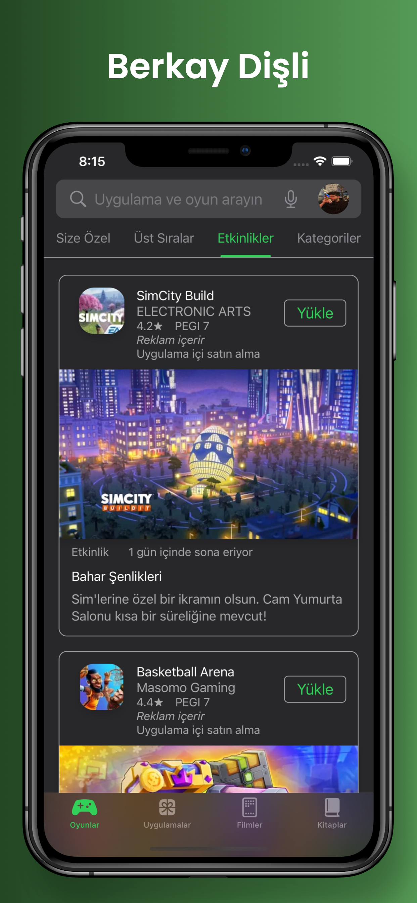
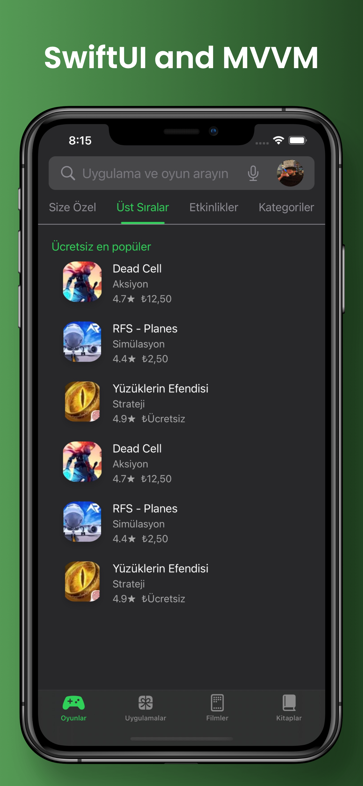
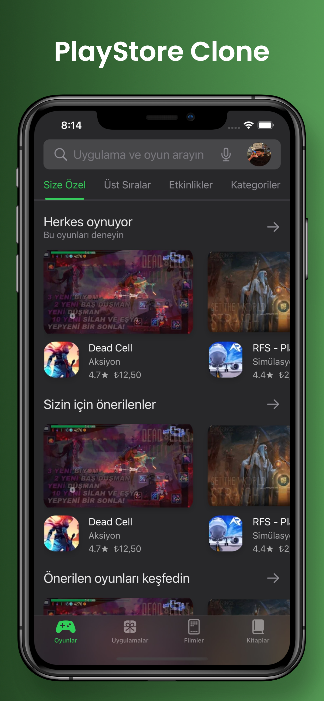

# PlayStoreClone
A simple clone of Play Store (ironically) using SwiftUI with MVVM architecture.

## Architecture
- SwiftUI and MVVM
- Position, Rotation, Scale and Hue Animations
- Native Tab Bar System
- Vertical and Horizontal ScrollViews, Lazy Stacks and Custom Items
- Custom Model Presentation
- Smoothly Delivered Moving and Opacity Transitions
 
## Concept

  
  
  

